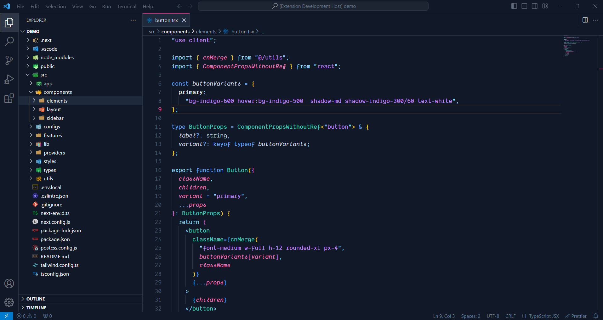
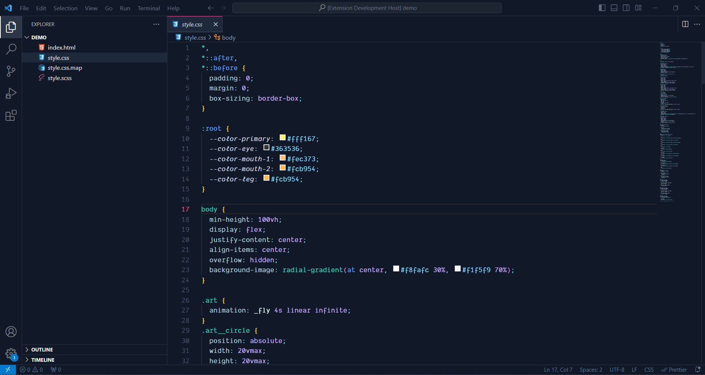
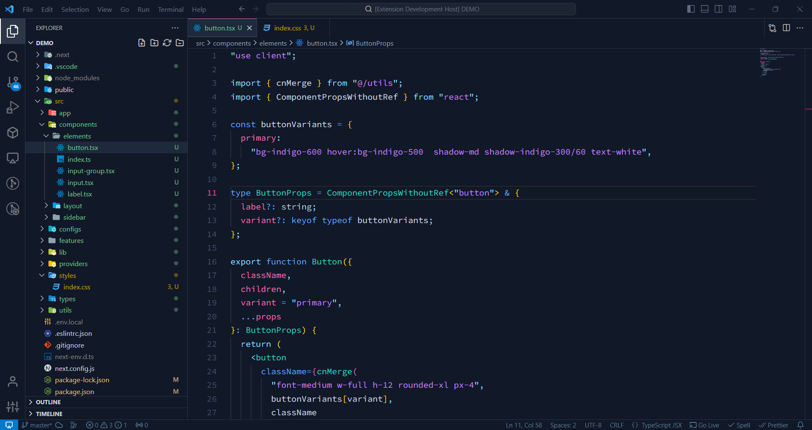
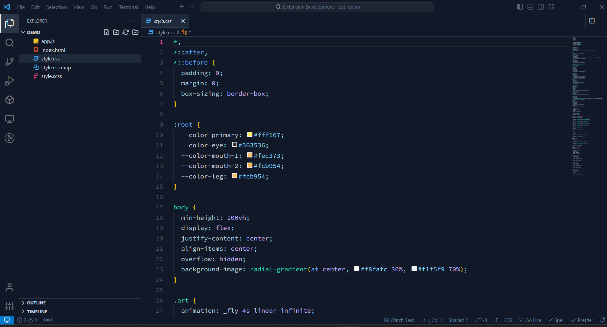

# Colorful Code 🌈

A dark Visual Studio Code theme. who love to vibrant and colorful coding environment.

## Colorful Code

### React

### CSS

## Colorful Code ( No Italic )

### React

### CSS

## How to install

1.  Install [Visual Studio Code](https://code.visualstudio.com/)
2.  Launch Visual Studio Code
3.  Choose **Extensions** from menu
4.  Search for `colorful-code` or `Colorful Code`
5.  Click **Install** to install it
6.  Click **Reload** to reload the Code
7.  From the menu bar click: Code > Preferences > Color Theme > **Colorful code**

## Install directly from marketplace

[Install Link](https://marketplace.visualstudio.com/items?itemName=MdUsmanAnsari.colorful-code)
